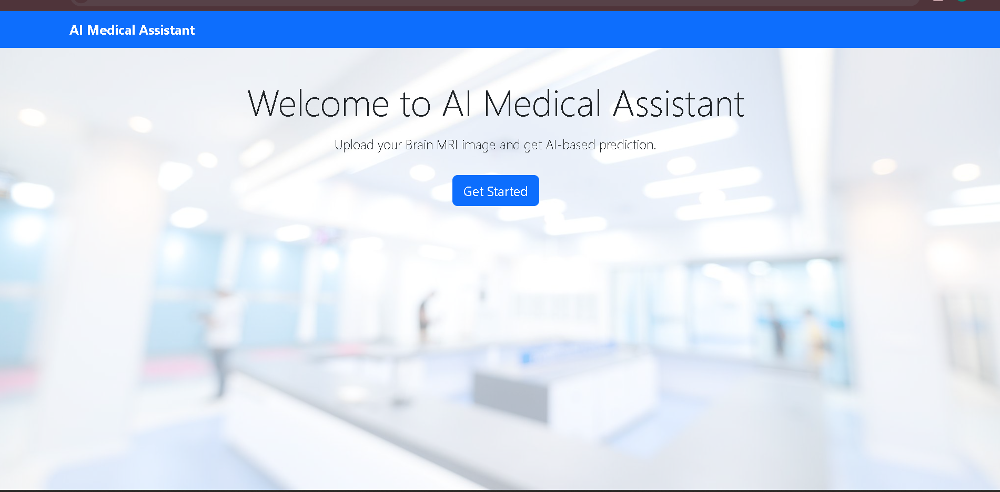
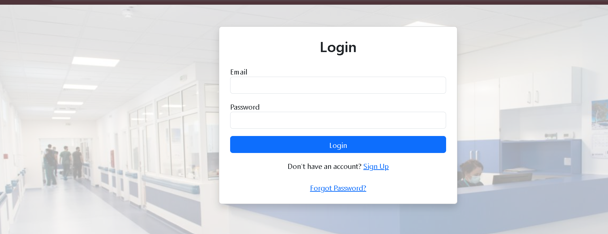
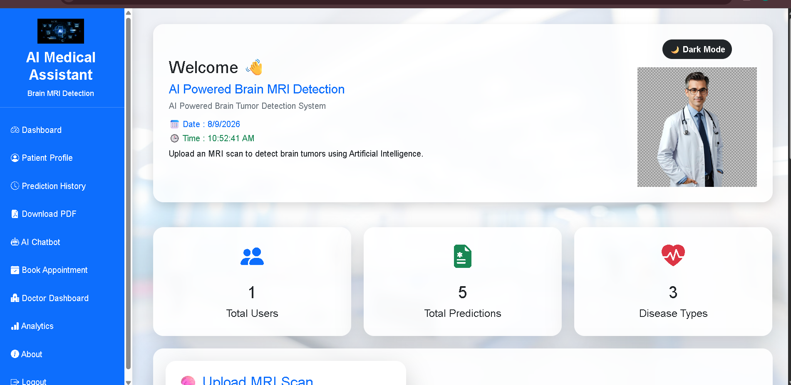

# 🧠 AI Medical Assistant

AI Medical Assistant is an AI-powered Brain MRI Detection System that analyzes MRI images and predicts possible brain tumor types using Deep Learning.

## 🚀 Features

- 🧠 Brain MRI image analysis
- 🤖 AI-based brain tumor prediction
- 📊 Prediction confidence score
- 👤 Patient details management
- 📄 Downloadable medical PDF report
- 📈 Disease prediction analytics
- 💬 AI Medical Chatbot
- 👨‍⚕️ Doctor recommendation
- 📅 Online appointment booking
- 🌓 Dark mode
- 🔐 Login and Signup system
- 🕒 Prediction history

## 🧬 Supported Predictions

The model can classify MRI images into:

- Glioma
- Meningioma
- Pituitary Tumor
- No Tumor

## 🛠️ Technologies Used

- Python
- Flask
- TensorFlow
- Keras
- SQLite
- HTML
- CSS
- JavaScript
- Bootstrap
- Matplotlib
- ReportLab

## 📸 Project Screenshots

### 🏠 Home Page



### 🔐 Login Page



### 📊 Dashboard



## 📂 Project Structure

```text
AI-Medical-Assistant/
│
├── app.py
├── database.py
├── predict.py
├── train.py
├── requirements.txt
├── database.db
│
├── model/
│   └── brain_tumor_model.h5
│
├── static/
│   ├── images/
│   ├── uploads/
│   └── charts/
│
├── templates/
│   ├── index.html
│   ├── login.html
│   ├── dashboard.html
│   ├── history.html
│   ├── analytics.html
│   ├── chatbot.html
│   ├── appointment.html
│   └── ...
│
└── screenshots/
    ├── home.png
    ├── login.png
    └── dashboard.png
